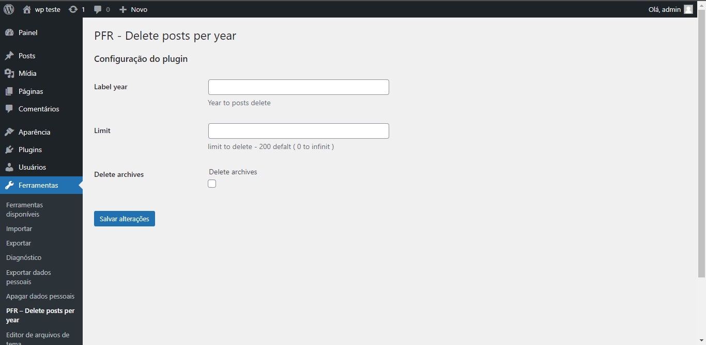

<h1>Delete posts per year</h1>

  
  

 

Plugin responsável por deletar todos os posts e registro de mídia do banco de dados referentes a um ano inteiro determinado pelo usuário. Este plugin não depende de outro para manter o seu funcionamento.

<h2>Funcionalidades do projeto</h2>

<code>Funcionalidade 1</code>: Campo para definir o ano;

<code>Funcionalidade 1</code>: Campo para definir um limite de posts apagados;

<code>Funcionalidade 1</code>: Campo para escolher deletar imagens ou não.

<h2>Acesso ao Projeto</h2>

Os arquivos podem ser baixados diretamente desse repositório em "code&gtDownload ZIP" e um arquivo .zip será baixado para a sua máquina.

<h3>Configurando o ambiente</h3>

Com o download feito, basta descompactar o arquivo no diretório de plugins do wordpress e renomear a pasta para: <code>pfr-delete-posts-per-year</code>. Após isso, vá para o painel de plugins e ative o plugin. Com o plugin ativado, será criado um novo menu de administração dentro da aba "Ferramentas" nomeado como "PFR - Delete posts per year".

<h3>Formas de uso</h3>

Na aba de administração do plugin estará disponível 3 (trÊs) campos em que o primeiro deverá receber um ano com quatro dígitos em um limite do ano atual, o segundo recebe um valor numérico com o limite de posts a serem deletados ao rodar o plugin (0 para infinito) e, o terceiro é um checkbox que, se marcado, apagará também os registros de imagens. Com o devido preenchimento do campo, basta clicar em "Salvar alterações" e o plugin irá recarregar a página e, enquanto ela é recarregada os posts e registros de imagens (se o checkbox for marcado ) serão apagados. É importante que não abra outra página ou recarregue a página atual enquanto a ação não estiver totalmente finalizada.

<h2>Tecnologias utilizadas</h2>
<ul>
  <li><code>PHP</code></li>
  <li><code>WordPress</code></li>
</ul>

<h2>Desenvolvedores</h2>
<a href="https://github.com/PedroFigueiraRuivo">
Pedro Figueira
</a>
